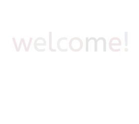
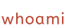

    

    
    <ul>
        <li>funny guy with high aspirations!</li>
        <li>evoluted caveman who learned how to code.</li>
        <li>developer that loves neat things.</li>
        <li>passionate about <i>creative coding</i>, <i>design</i>, <i>FOSS</i> & <i>automation</i>.</li>
    </ul>

    
    <ul>
        <li>
            
studying <b>Computer Engineering</b> @ <a href="https://www.unicamp.br/unicamp/" target="_blank"><i>Unicamp</i></a

        </li>
        <li>
            
certificate in <b>Biotechnology</b> @ <a href="https://www.ifes.edu.br/" target="_blank"><i>IFES</i></a

        </li>
    </ul>

    
    <picture>
    <source
      srcset="https://github-readme-stats.vercel.app/api?username=icarochiabai&show_icons=true&theme=transparent&title_color=bb4430&icon_color=bb4430&hide_border=true&text_color=ebf5ee"
      media="(prefers-color-scheme: dark)"
    />
    <source
      srcset="https://github-readme-stats.vercel.app/api?username=icarochiabai&show_icons=true&theme=transparent&title_color=bb4430&icon_color=bb4430&hide_border=true&text_color=231f20"
      media="(prefers-color-scheme: light), (prefers-color-scheme: no-preference)"
    />
    
    </picture>

    

